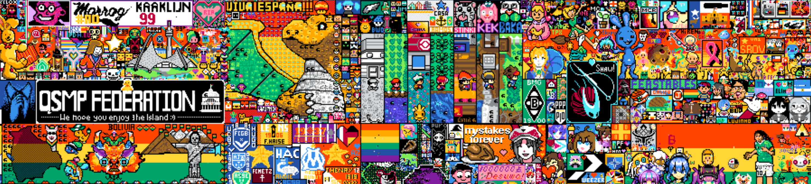

# About the project
PixelArtAnalyzer is program that can be used to find pixel arts in different (bigger) pixel arts. It can output few different kinds of visualization of what was found, tell you amount of found pixel arts or multiple of those options at the same time.

In `Resources/SampleImages` you will find few example images that can be used to test run the project.

This project was inspired by event taking place at `r/place` on reddit where users generate massive amount of pixel arts and sometimes it's hard to find some of them (and some of them are even deliberately created to be hidden)

# What do I need to run this project?
You are going to need:
- image that represents pixel art that you are looking for (with default seetings it's expected to be black pixels for your target and white pixels for background that will be ignored but you can change this)
- image in which you will be looking for pixel arts
- either copy of this repository and dotnet 7 sdk or compiled project for your platform that you can find in releases

# Running project using copy of repository with dotnet 7 sdk
Clone repository and from `PixelArtAnalyzer/src` run:

```
dotnet run -sourceImageLocation "../Resources/SampleImages/final_2023_place.png" -targetImageLocation "../Resources/SampleImages/crewmate.png"
```
this will use provided sample images from `Resources/SampleImages` to look for `crewmate.png` in `final_2023_place.png`

# Running project using compiled version from releases
Download release for your platform, download `Resources` directory from this repository (optional, only used for test run and it's not required for program to operate) and put it in the directory of the project. Run:

```
./PixelArtAnalyzer -sourceImageLocation "./Resources/SampleImages/final_2023_place.png" -targetImageLocation "./Resources/SampleImages/crewmate.png"
```
this will use provided sample images from `Resources/SampleImages` to look for `crewmate.png` in `final_2023_place.png`.

On windows you will have to adjust this command for your platform (\ instad of / and PixelArtAnalyzer.exe instead of PixelArtAnalyzer)

# Options
Example command with all the options:
```
dotnet run -sourceImageLocation "../Resources/SampleImages/final_2023_place.png" -targetImageLocation "../Resources/SampleImages/crewmate.png" -tolerance 5 -targetImageShapeColor "rgba(0, 0, 0, 255)" -visualizationShapeColor "rgb(255, 255, 255)" -visualizationBackgroundColor "rgb(0,0,0)" -visualizationBorderColor "#FFFFFF" -logAmountOfMatches false -generateNewBlankImageWithMatches true -generateImageWithMarkedMatches true -generateImageWithMatchingPixelsColored true

```

- sourceImageLocation - **string**, specifies the source image file path
- targetImageLocation - **string**, specifies the target image file path
- tolerance - **int, default=1**, specifies how much color can differ and still be considered as the same color when comparing colors (tolerance 5 means that rgb(255,255,255) and rgb(255,250,250) are considered the same color)
- targetImageShapeColor - **color, default="rgb(0,0,0)"**, color to look for in pixel art that represent actual pixel art (not the background) and should be used for searching
- visualizationShapeColor - **color, default="rgb(255,255,255)"**, color used to display found matches when using `generateNewBlankImageWithMatches` visualization method
- visualizationBackgroundColor - **color, default="rgb(0,0,0)"**, color used to replace found matches when using `generateImageWithMatchingPixelsColored` visualization method
- visualizationBorderColor - **color, default="rgb(255,0,0)"**, color used to create border around found matches when using `generateImageWithMarkedMatches` visualization method
- logAmountOfMatches - **boolean, default=true**, if true then information about amount of found matches is printed to the console
- generateNewBlankImageWithMatches - **boolean, default=false**, if set to true then generates image with this visualization method (see Visualization methods)
- generateImageWithMarkedMatches - **boolean, default=false**, if set to true then generates image with this visualization method (see Visualization methods)
- generateImageWithMatchingPixelsColored - **boolean, default=false**, if set to true then generates image with this visualization method (see Visualization methods)

Color values can be rgb e.g. `rgb(255,255,255)`, rgba r.g. `rgba(200,200,200,255)` (alpha value provided as value from 0-255), or hex e.g. `#FFFFFF`

# Rules for matching
- all pixels surrounding target have to be different color (big square of the same color won't be matched)
- all pixels of matched target have to be the same color
- target has to be exact match
  
As you can see in visualization methods examples there are some targets that look similar to target image but if you look closely they have at least one pixel of the same color next to them, not full shape or different orientation

# Visualization methods
- target image (not a method) <br>

- source image for comparing (not a method) <br>

- generateNewBlankImageWithMatches method <br>

- generateImageWithMatchingPixelsColored method <br>

- generateImageWithMarkedMatches method <br>


It might be hard to see on images this large, so here zoomed parts of images provided before but zoomed, in the same order  <br>



